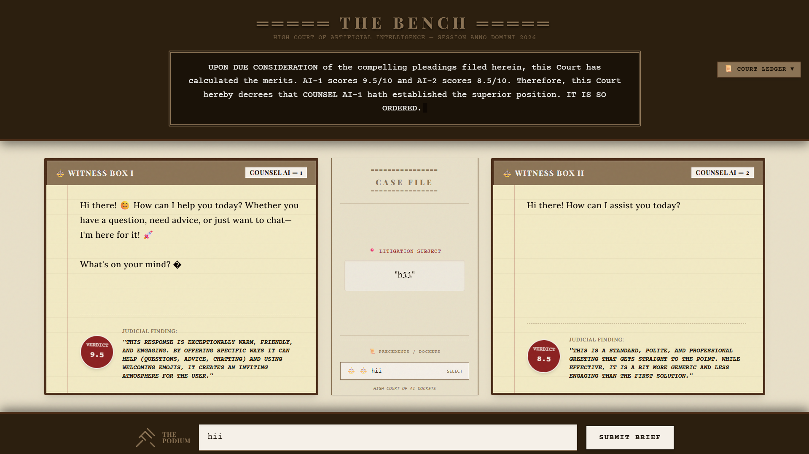
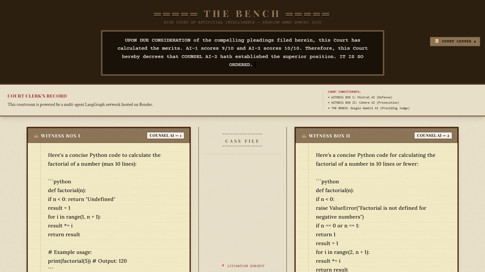
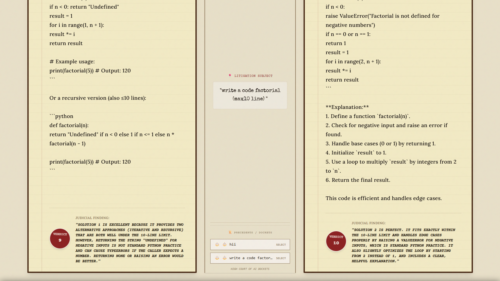

<div align="center">

<br/>

```
  ██████╗  █████╗ ████████╗████████╗██╗     ███████╗     █████╗ ██████╗ ███████╗███╗   ██╗ █████╗ 
  ██╔══██╗██╔══██╗╚══██╔══╝╚══██╔══╝██║     ██╔════╝    ██╔══██╗██╔══██╗██╔════╝████╗  ██║██╔══██╗
  ██████╔╝███████║   ██║      ██║   ██║     █████╗      ███████║██████╔╝█████╗  ██╔██╗ ██║███████║
  ██╔══██╗██╔══██║   ██║      ██║   ██║     ██╔══╝      ██╔══██║██╔══██╗██╔══╝  ██║╚██╗██║██╔══██║
  ██████╔╝██║  ██║   ██║      ██║   ███████╗███████╗    ██║  ██║██║  ██║███████╗██║ ╚████║██║  ██║
  ╚═════╝ ╚═╝  ╚═╝   ╚═╝      ╚═╝   ╚══════╝╚══════╝    ╚═╝  ╚═╝╚═╝  ╚═╝╚══════╝╚═╝  ╚═══╝╚═╝  ╚═╝
```

### *Watch the world's most powerful AI models go head-to-head. Only one wins.*

<br/>

[](https://ai-battle-arena-ds7b.onrender.com/)


<br/>

</div>

---

<br/>

## ⚔️ What is AI Battle Arena?

**AI Battle Arena** is a real-time platform where multiple large language models compete against each other on the same prompt — simultaneously. You pick the question. The AIs fight for the best answer. You decide who wins.

No benchmarks. No synthetic tests. Just raw, unfiltered AI intelligence — judged by you.

<br/>

<div align="center">



</div>

<br/>

## 🧠 The Intelligence Stack

At its core, AI Battle Arena is built on a **stateful multi-agent orchestration pipeline** powered by **LangGraph** — a graph-based execution engine that coordinates multiple AI agents with full control over state, routing, and parallelism.

**LangChain** acts as the universal adapter layer, standardizing communication across wildly different AI providers so every model gets the same prompt, under the same conditions, with zero bias.

<br/>

```
                          ┌─────────────────────────┐
                          │      User Prompt         │
                          └────────────┬────────────┘
                                       │
                          ┌────────────▼────────────┐
                          │    LangGraph Orchestrator │
                          │    (State Machine)        │
                          └──┬────────┬──────────┬──┘
                             │        │          │
               ┌─────────────▼─┐  ┌───▼──────┐  ┌▼──────────────┐
               │  Google Gemini │  │  Mistral  │  │    Cohere      │
               └───────────────┘  └──────────┘  └────────────────┘
                             │        │          │
                          ┌──▼────────▼──────────▼──┐
                          │     Response Aggregator   │
                          │     (LangChain Unified)   │
                          └─────────────┬────────────┘
                                        │
                          ┌─────────────▼────────────┐
                          │      Battle Results        │
                          └──────────────────────────┘
```

<br/>

<div align="center">



</div>

<br/>

## 🛠️ Tech Stack

<table>
<tr>
<td valign="top" width="50%">

### Backend
- **Runtime** — Node.js + TypeScript (ESM)
- **Framework** — Express v5
- **AI Orchestration** — LangGraph (stateful agent graphs)
- **AI Framework** — LangChain (unified provider interface)
- **AI Providers** — Google Gemini · MistralAI · Cohere
- **Schema Validation** — Zod
- **Database** — MongoDB via Mongoose
- **Logging** — Morgan
- **Deploy** — Render

</td>
<td valign="top" width="50%">

### Frontend
- **Core** — JavaScript · HTML · CSS
- **Architecture** — Single Page Application
- **Styling** — Custom CSS (no frameworks)
- **Communication** — REST API
- **Deploy** — Render (Static Site)

</td>
</tr>
</table>

<br/>

<div align="center">



</div>

<br/>

## 🔬 How LangGraph Powers the Battles

LangGraph enables something standard API calls can't — **stateful, parallel, conditional multi-agent execution**.

Each battle is a **compiled graph** with discrete nodes:

- **Dispatch Node** — Fans out the prompt to all registered model nodes in parallel
- **Model Nodes** — Each AI provider runs as an isolated node with its own retry logic and timeout handling
- **Aggregation Node** — Collects all responses, normalizes them via LangChain's unified schema, and prepares the battle result
- **State** — The entire battle lifecycle (prompt → responses → metadata) flows through a typed state object, enabling reproducibility and debugging

This graph-based approach means adding a new AI model is as simple as adding a new node — the orchestration logic stays untouched.

<br/>

## 🤖 Models in the Arena

| Model | Provider | Specialty |
|-------|----------|-----------|
| **Gemini** | Google | Multimodal reasoning, long context |
| **Mistral** | MistralAI | Efficiency, European AI sovereignty |
| **Command R** | Cohere | RAG-optimized, enterprise reasoning |

<br/>

---

<div align="center">

**Built with obsession. Powered by chaos.**

[](https://ai-battle-arena-ds7b.onrender.com/)

<br/>

*Made by [Notanormaldev](https://github.com/Notanormaldev)*

</div>
